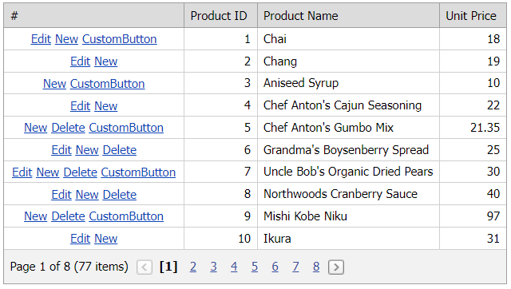

# GridView for ASP.NET Web Forms - How to specify the settings of built-in and custom command buttons based on a condition
<!-- run online -->
**[[Run Online]](https://codecentral.devexpress.com/e3028/)**
<!-- run online end -->

This example demonstrates how to handle the grid's `CommandButtonInitialize` and `CustomButtonInitialize` events to specify the visibility of built-in and custom command buttons.



## Overview

Follow the steps below:

1. Create the [Grid View](https://docs.devexpress.com/AspNet/DevExpress.Web.ASPxGridView) control, populate it with columns, and bind it to a data source. Add a [GridViewCommandColumn](https://docs.devexpress.com/AspNet/DevExpress.Web.GridViewCommandColumn) and enable its [ShowEditButton](https://docs.devexpress.com/AspNet/DevExpress.Web.GridViewCommandColumn.ShowEditButton), [ShowNewButton](https://docs.devexpress.com/AspNet/DevExpress.Web.GridViewCommandColumn.ShowNewButton), and [ShowDeleteButton](https://docs.devexpress.com/AspNet/DevExpress.Web.GridViewCommandColumn.ShowDeleteButton) properties to display built-in command buttons. Use the column's [CustomButtons](https://docs.devexpress.com/AspNet/DevExpress.Web.GridViewCommandColumn.CustomButtons) property to create a custom command button.

    ```aspx
    <dx:ASPxGridView ID="ASPxGridView1" runat="server" AutoGenerateColumns="False" KeyFieldName="ProductID"
        DataSourceID="AccessDataSource1" OnCommandButtonInitialize="ASPxGridView1_CommandButtonInitialize"
        OnCustomButtonInitialize="ASPxGridView1_CustomButtonInitialize">
        <!-- ... -->
        <Columns>
            <dx:GridViewCommandColumn VisibleIndex="0" ShowEditButton="True" ShowNewButton="True"
                ShowDeleteButton="True">
                <CustomButtons>
                    <dx:GridViewCommandColumnCustomButton ID="btnCustom" Text="CustomButton" />
                </CustomButtons>
            </dx:GridViewCommandColumn>
            <!-- ... -->
        </Columns>
    </dx:ASPxGridView>
    <asp:AccessDataSource ID="AccessDataSource1" runat="server" DataFile="~/App_Data/nwind.mdb"
        <!-- ... --
    </asp:AccessDataSource>
    ```

2. Handle the grid's server-side [CommandButtonInitialize](https://docs.devexpress.com/AspNet/DevExpress.Web.ASPxGridView.CommandButtonInitialize) event. In the handler, use the [ButtonType](https://docs.devexpress.com/AspNet/DevExpress.Web.ASPxGridViewCommandButtonEventArgs.ButtonType) and [Visible](https://docs.devexpress.com/AspNet/DevExpress.Web.ASPxGridCommandButtonEventArgs.Visible) argument properties to identify a particular command button and specify its visibility based on a custom criteria.

    ```csharp
    protected void ASPxGridView1_CommandButtonInitialize(object sender, ASPxGridViewCommandButtonEventArgs e) {
        if (e.VisibleIndex == -1) return;

        switch (e.ButtonType) {
            case ColumnCommandButtonType.Edit:
                e.Visible = EditButtonVisibleCriteria((ASPxGridView)sender, e.VisibleIndex);
                break;
            case ColumnCommandButtonType.Delete:
                e.Visible = DeleteButtonVisibleCriteria((ASPxGridView)sender, e.VisibleIndex);
                break;
        }
    }

    private bool EditButtonVisibleCriteria(ASPxGridView grid, int visibleIndex) {
        // ...
    }
    private bool DeleteButtonVisibleCriteria(ASPxGridView grid, int visibleIndex) {
        // ...
    }
    ```

3. Handle the grid's server-side [CustomButtonInitialize](https://docs.devexpress.com/AspNet/DevExpress.Web.ASPxGridView.CustomButtonInitialize) event. In the handler, use the [ButtonID](https://docs.devexpress.com/AspNet/DevExpress.Web.ASPxGridCustomCommandButtonEventArgs.ButtonID) and [Visible](https://docs.devexpress.com/AspNet/DevExpress.Web.ASPxGridCustomCommandButtonEventArgs.Visible) argument properties to identify the custom command button and specify its visibility based on a condition.

    ```csharp
    protected void ASPxGridView1_CustomButtonInitialize(object sender, ASPxGridViewCustomButtonEventArgs e) {
        if (e.VisibleIndex == -1) return;

        if (e.ButtonID == "btnCustom" && e.VisibleIndex % 2 != 0)
            e.Visible = DefaultBoolean.False;
    }
    ```

## Files to Review

* [Default.aspx](./CS/WebSite/Default.aspx) (VB: [Default.aspx](./VB/WebSite/Default.aspx))
* [Default.aspx.cs](./CS/WebSite/Default.aspx.cs) (VB: [Default.aspx.vb](./VB/WebSite/Default.aspx.vb))

## Documentation

* [CommandButtonInitialize](https://docs.devexpress.com/AspNet/DevExpress.Web.ASPxGridView.CommandButtonInitialize)
* [CustomButtonInitialize](https://docs.devexpress.com/AspNet/DevExpress.Web.ASPxGridView.CustomButtonInitialize)
